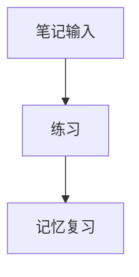

# 编辑器指南

## 模块定位与适用人群
编辑器是 Yaru 的内容生产核心，适合做课程笔记、题解、公式推导、复习卡片草稿和结构化写作。

## 入口路径
- 笔记编辑：`/notes`
- Studio 编辑：`/studio/*`
- 课程编辑：`/studio/courses/:courseId`

## 关键实现基线（2026-02-17，Web/WASM）
- `flutter build web --wasm` 是必须支持的构建路径。
- 编辑器接入必须统一通过 `Monorepo/packages/editor`。
- 当前编辑器底层为 `appflowy_editor_wasm`（WASM 兼容实现）。
- Flutter 代码禁止直接使用 `dart:html` 和 `package:universal_html/*`。
- Web 条件导入统一使用 `if (dart.library.js_interop)`。
- 详细基线见：`Monorepo/apps/Flutter/WASM_COMPATIBILITY.md`。

## 功能总览
| 功能 | 场景说明 | 状态 |
|---|---|---|
| Markdown 基础语法 | 快速写结构化学习笔记 | 已可用 |
| LaTeX 公式输入 | 理工科公式、定理、推导写作 | 已可用 |
| 代码高亮块 | 记录代码片段与算法思路 | 已可用 |
| Mermaid/TikZ 代码片段 | 以代码形式记录流程图/图形草稿 | 已可用 |
| 闪卡语法 | 写作时直接生成复习卡片草稿 | 已可用 |
| 快捷键与斜杠命令 | 高频编辑加速 | 已可用 |

常用 Markdown 语法（示例）：
````markdown
# 一级标题
[H2] 二级标题
- 列表项
1. 有序项
`inline code`
```text
code block
```
> 引用
````

LaTeX 示例（常用）：
```latex
$E=mc^2$
$$\int_a^b f(x)\,dx$$
$$\frac{d}{dx}(x^n)=nx^{n-1}$$
$$\begin{bmatrix}a&b\\c&d\end{bmatrix}$$
```

Mermaid/TikZ 代码示例（以代码保存，不保证在 docs 阅读器中渲染）：


```latex
\begin{tikzpicture}
\draw (0,0) -- (2,0) -- (1,1.5) -- cycle;
\end{tikzpicture}
```

## 典型任务流程
1. 当你准备写一节课笔记时，先用标题和列表搭骨架。
2. 在关键公式处输入 LaTeX，并用代码块记录推导过程。
3. 把可复习知识点改写成闪卡语法并保存。
4. 跳转 `记忆` 检查卡片草稿并进入复习。

## 高级用法与效率技巧
- 当你在同一页处理“解释 + 公式 +代码”时，按“段落 -> 公式 -> 代码块”固定顺序可减少返工。
- 高频快捷键建议至少记住：`Ctrl/Cmd + B`、`Ctrl/Cmd + K`、`/`、`[[`。
- 对复杂参数（如高级排版）先使用默认样式，必要时再进入高级设置。

> [注意] `DocsReaderScreen` 基于 `flutter_markdown`，文档中的 Mermaid/TikZ 以代码展示为主，不承诺图形渲染。

## 权限/角色/前置条件
- 普通用户可在笔记模块使用编辑器能力。
- Studio 编辑与发布能力受角色限制。

## 常见问题与排错
- 快捷键无响应：先确认焦点在编辑区，且输入法未占用组合键。
- 公式显示异常：检查分隔符是否闭合（`$...$` / `$$...$$`）。
- 代码样式不对：确认已使用三反引号代码块并指定语言。

## 相关模块联动
- 编辑器 -> `笔记指南`：沉淀长期知识。
- 编辑器 -> `记忆指南`：把写作结果转入复习系统。
- 编辑器 -> `开发者手册`：查看 docs 渲染与内容注册限制。
- 编辑器 -> `常见问题与排错`：定位 WASM 构建和平台兼容问题。
